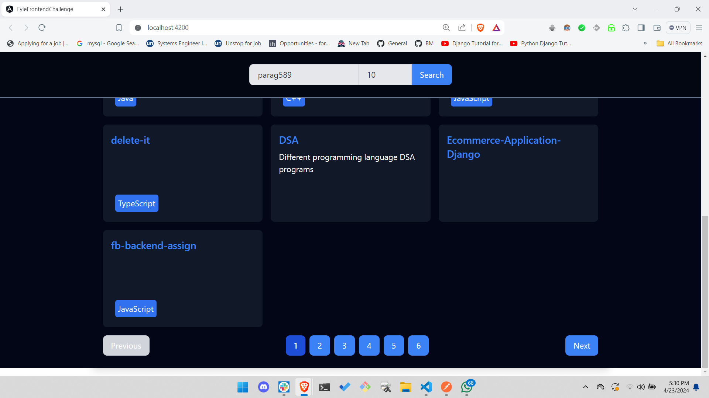

# My Frontend Challenge

My GitHub Repo Finder is an Angular application that enables users to effortlessly explore GitHub repositories and gather insights into the users who own them.

## Introduction

Welcome to my GitHub Repo Finder, a web application crafted with Angular. It empowers users to delve into GitHub repositories seamlessly. Leveraging the GitHub API, this application delivers user and repository data in a user-friendly interface, offering a delightful experience for GitHub enthusiasts.

## Features

Here are the highlights of My GitHub Repo Finder:

1. **Streamlined Repository Search:** Users can swiftly search for GitHub repositories by simply entering a GitHub username.

2. **Comprehensive User Profiles:** My application showcases detailed user profiles, including name, bio, location, and blog details.

3. **Insightful Repository Listings:** Users can peruse repositories owned by the searched GitHub user, with comprehensive details such as name, description, and more.

4. **Efficient Pagination:** My GitHub Repo Finder implements server-side pagination for repository display, providing users with flexibility in viewing repositories (defaulting to 10 per page, with an option to view up to 100).

5. **Adaptive Design:** The application is designed to adapt seamlessly to various screen sizes, ensuring a consistent user experience across devices.

## Dependencies

My GitHub Repo Finder relies on the following key dependencies:

1. **Angular 14+:** Built on the Angular framework, providing a sturdy foundation for frontend development.

2. **Tailwind CSS:** Employs Tailwind CSS for styling, embracing a utility-first approach for streamlined UI design.

3. **Axios:** Utilizes Axios for making HTTP requests, facilitating interaction with the GitHub API to fetch user and repository data.

4. **GitHub API:** Interacts with the GitHub REST API to retrieve user and repository information, leveraging the rich functionalities provided by the API.

## Here are the Screenshots 

<a>
    
  </a>
  </br/><br/>

  <a>
    
  </a>
  </br/><br/>

  <a>
    
  </a>
  </br/><br/>

  <a>
    
  </a>
  </br/><br/>

## Getting Started

### Prerequisites

Before you embark on this journey, ensure that you have Node.js and npm installed on your machine. If not, you can download them from [nodejs.org](https://nodejs.org/).

### Installation

Let's get started:

1. Clone this repository to your local machine:
```bash
https://github.com/your-username/my-frontend-challenge.git
```

2. Navigate to the project directory:
```bash
cd my-frontend-challenge
```

3. Install project dependencies:
```bash
npm install
```

### Running the Application

To launch My GitHub Repo Finder, execute the following command:

```bash
ng serve
```

This command will start the development server. Open your web browser and navigate to http://localhost:4200/ to access the application.

## Running Tests

To ensure the reliability and quality of my code, I've included unit tests with 100% code coverage for the user-info component and API service. Here's how you can run them:

For service tests:
```bash
npm run test:apiservice
```

For component tests:
```bash
npm run test:userinfo
```

These commands will run the tests and generate a comprehensive code coverage report.

### Testing Libraries:

I've utilized the following testing libraries:

1. **Jasmine**: Widely adopted for writing unit tests, Jasmine provides an intuitive syntax for crafting test cases and assertions.

2. **Karma**: Serving as the test runner, Karma executes the unit tests in real browsers, ensuring compatibility across different environments.

3. **Angular Testing Utilities**: Leveraging Angular's testing utilities, including TestBed, ComponentFixture, and async, to streamline testing processes and maintain code integrity.

## Acknowledgments

I thoroughly enjoyed working on this challenge! Special thanks to  for providing such a fantastic learning opportunity.
